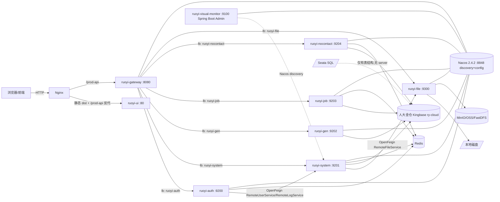

# Survey: NoContactMonitorCloud

> 注：当前仓库不是单独的前端原型项目，而是基于上游 `RuoYi-Cloud v3.6.8` 持续扩展后的实际业务仓库。现状已经包含 `ruoyi-nocontact` 业务服务、问卷模块、营商环境无感监测相关前后端页面、人大金仓 Kingbase 启动与部署脚本，下文按当前真实交付状态整理。

## Repo Summary

`NoContactMonitorCloud` 仍然以 RuoYi-Cloud 为底座，技术栈为 Spring Boot 2.7.18 / Spring Cloud 2021.0.9 / Spring Cloud Alibaba 2021.0.6.1 / JDK 1.8，前端为 Vue 2.6.12 + Element UI 2.15.14。当前业务交付基线已经统一到**人大金仓 Kingbase**：Nacos（注册+配置）、Redis（缓存/token）、Kingbase（业务与配置库）、Spring Boot Admin（监控）和 `ruoyi-nocontact` 无感监测业务域共同构成现有系统。

## Architecture Overview

**请求主链路**：浏览器 → nginx(80) → gateway(8080) → auth(9200) [登录] / system/gen/job/nocontact/file (业务) → Kingbase/Redis。**内部调用**：auth→system、system→file 经 OpenFeign + `@InnerAuth`。**配置/发现**：所有服务 bootstrap.yml 拉 Nacos `application-dev.yml` 共享配置 + Nacos Discovery 注册。

## Discovered Topics

> 来源：14 个模块深扫 + 横切关注点扫描 + 结构扫描。Tier: **1=核心, 2=重要但专业, 3=薄/可选**。

### Tier 1 — 核心

| Topic | 路径 | 端口 | 用途 |
|---|---|---|---|
| Gateway 网关 | `ruoyi-gateway` | 8080 | WebFlux 路由、JWT 鉴权（`AuthFilter`）、XSS 清洗（`XssFilter`）、验证码（`ValidateCodeFilter`）、黑白名单（`BlackListUrlFilter`）、Sentinel 流控、Swagger 聚合 |
| Auth 认证中心 | `ruoyi-auth` | 9200 | login/logout/refresh/register/unlock；不直连 DB，**全部走 OpenFeign** 调 system 完成密码校验 + 登录日志 |
| System 系统业务核心 | `ruoyi-modules/ruoyi-system` | 9201 | RBAC: 用户/角色/菜单/部门/岗位/字典/参数/公告(已读)/操作日志/登录日志/在线用户；`@InnerAuth` 暴露 3 个 Feign 服务端 |
| Nocontact 无感监测业务域 | `ruoyi-modules/ruoyi-nocontact` | 9204 | 问卷、数据融合、监测预警、外部同步、报告生成、公共支撑等业务闭环 |
| UI 前端 | `ruoyi-ui` | 80 (dev 9526) | Vue 2 + Element UI SPA；动态路由、按钮级权限（`v-hasPermi`）、RSA 登录加密、`request.js` 拦截器 |
| Common-Core | `ruoyi-common/ruoyi-common-core` | — | 响应体 R/AjaxResult/TableDataInfo、BaseEntity/BaseController、PageHelper、异常、Excel/Xss 注解、工具类、常量、TTL SecurityContext |
| Common-Security | `ruoyi-common/ruoyi-common-security` | — | TokenService、HeaderInterceptor、FeignRequestInterceptor、PreAuthorizeAspect、InnerAuthAspect、GlobalExceptionHandler、`@EnableCustomConfig`/`@EnableRyFeignClients` |
| Common-Datasource + Datascope | `ruoyi-common/ruoyi-common-datasource` + `ruoyi-common/ruoyi-common-datascope` | — | `@Master`/`@Slave` 动态数据源（Druid+dynamic-ds 4.3.1）；`@DataScope` 行级权限 AOP 注入 5 种数据范围 SQL |
| API-System 远程契约 | `ruoyi-api/ruoyi-api-system` | — | RemoteUserService/RemoteLogService/RemoteFileService + DTO（SysUser/SysRole/LoginUser 等）+ FallbackFactory |
| Infra (sql/docker/bin) | `sql/`, `docker/`, `bin/` | 54321/6379/8848 + 业务端口 | Kingbase 手工初始化、docker-compose 一键部署、Windows bat 启动 |

### Tier 2 — 重要但专业

| Topic | 路径 | 端口 | 用途 |
|---|---|---|---|
| Gen 代码生成 | `ruoyi-modules/ruoyi-gen` | 9202 | Velocity 模板渲染 java/xml/sql/vue/ts；预览/zip 下载/写本地；`information_schema` 读表结构 |
| Job 定时任务 | `ruoyi-modules/ruoyi-job` | 9203 | Quartz 内存 RAMJobStore（**ScheduleConfig 整文件被注释**）；`invokeTarget=bean.method(args)` 反射执行 |
| File 文件服务 | `ruoyi-modules/ruoyi-file` | 9300 | LocalSysFileServiceImpl（`@Primary`） + MinIO + FastDFS 三实现并存，由 Nacos 切后端 |
| Monitor 监控 | `ruoyi-visual/ruoyi-monitor` | 9100 | spring-boot-admin-starter-server 2.7.16；Nacos discovery 聚合 client |
| Common-Log | `ruoyi-common/ruoyi-common-log` | — | `@Log` 注解 + LogAspect + AsyncLogService（异步 Feign 回调 system `/operlog`） |
| Common-Redis | `ruoyi-common/ruoyi-common-redis` | — | `RedisService` 工具类 + `RedisConfig`（Redisson/Fastjson2 序列化）+ autoType 白名单 |
| Common-Swagger | `ruoyi-common/ruoyi-common-swagger` | — | springdoc-openapi-ui 1.7.x + 网关 Server 列表 |

### Tier 3 — 薄/可选

| Topic | 路径 | 用途 |
|---|---|---|
| Common-Sensitive | `ruoyi-common/ruoyi-common-sensitive` | `@Sensitive` 注解 + Jackson 脱敏序列化（手机/身份证/邮箱） |
| Common-Seata | `ruoyi-common/ruoyi-common-seata` | **空壳** — 仅有 pom，无源码；主 pom 仅有 dependencyManagement 条目；全仓零 `io.seata` 运行时依赖 |

## Build & Test

| 步骤 | 命令 | 范围 |
|---|---|---|
| 父级构建 | `mvn clean install -DskipTests` | 仓库根 — 拉所有 18 子模块 |
| 父级构建（含子模块指定） | `mvn clean package -pl ruoyi-gateway,ruoyi-auth,ruoyi-modules/ruoyi-system -am -DskipTests` | 增量构建（gateway+auth+system 及其依赖） |
| 后端单模块 | `cd ruoyi-modules/ruoyi-system && mvn spring-boot:run` | 需先启动 Nacos+Kingbase+Redis |
| 前端安装 | `cd ruoyi-ui && npm install` | node>=8.9 |
| 前端开发 | `npm run dev` | vue-cli-service serve，devServer proxy `/dev-api` → `localhost:8080` |
| 前端生产构建 | `npm run build:prod` / `npm run build:stage` | 产物 `ruoyi-ui/dist` |
| 前端 lint/test | **无** — package.json 无 lint/test 脚本 | 潜在 CI 盲区 |
| 一键部署 | `docker/copy.sh` + `cd docker && docker-compose up -d` | 当前 compose 启动 nacos→redis→gateway/auth/system/gen/job/nocontact/file→nginx；不含 mysql |
| SQL 初始化 | 手动执行，见 `sql/mysql/README.md` | 当前运行基线为 Kingbase 手工导入；仓库保留少量历史 MySQL 文件仅作参考，不再自动导入 |

> **强事实证据**：`ruoyi-nocontact` 当前 Nacos 配置明确使用 Kingbase 数据源（`sql/kingbase/ruoyi-nocontact-dev.yml`），`docker/nacos/conf/application.properties` 也已切到 Kingbase 插件路径，`sql/kingbase/ry-config.sql` 已直接写入 PostgreSQL 兼容 JDBC 配置。因此基础初始化、Nacos 配置导入、问卷/无感菜单同步、Kingbase 业务库导入必须按手动顺序执行。

## Key Patterns

| 模式 | 实现位置 | 说明 |
|---|---|---|
| 统一响应 | `R.java` / `AjaxResult` / `TableDataInfo` | 双体并存：R 走 Feign，AjaxResult 走 Web 控制器 |
| 鉴权 token | `TokenService.createToken`（UUID + JWT） | UUID 写 Redis `login_tokens:{user_key}`，JWT 签名 (HS512) 仅放 user_key/user_id/username；JWT 不可撤销，依赖 Redis 过期 |
| 网关白名单 | `AuthFilter` + Nacos `security.ignore.whites` | 走 `@RefreshScope` 热刷新；Pattern 是 (.*?) 替换 ** 非贪婪匹配 |
| 权限 AOP | `PreAuthorizeAspect` + `AuthUtil` | `@RequiresLogin`/`@RequiresPermissions`/`@RequiresRoles` 三注解 + PatternMatchUtils 通配 |
| 内部调用 | `FeignRequestInterceptor` + `@InnerAuth` | Feign 头透传 user_id/user_key/username/Authorization；目标服务校验 `from-source==inner` |
| 数据权限 | `@DataScope` + `DataScopeAspect` | AOP 写入 `BaseEntity.params.dataScope`，MyBatis XML `${params.dataScope}` 字符串拼接（**SQL 注入面，详见 risks**） |
| 操作日志 | `@Log` + `LogAspect` | 同步上下文 → `AsyncLogService` 异步 Feign 回调 `system/operlog`；自动屏蔽 password/oldPassword/newPassword/confirmPassword |
| 跨线程上下文 | `TransmittableThreadLocal` | SecurityContextHolder 走 TTL，Hystrix/线程池切换仍透传；需在 main 挂 TtlAgent |
| 代码生成 | `VelocityInitializer` + `GenConfig`（public static） | GenConfig 是 static 字段，多模块共用时 Nacos 推送会相互覆盖 |
| 验证码 | `ValidateCodeServiceImpl` + Kaptcha（math/char 双 Producer） | 网关层生成，存 Redis `captcha_codes:{uuid}`；仅 `/auth/login` `/auth/register` 校验 |
| MyBatis 规范 | `com.ruoyi.**.mapper` 接口 + 同包镜像 `src/main/resources/mapper/{module}/XxxMapper.xml` | `@MapperScan` 来自 `@EnableCustomConfig` |
| 业务异常 | `ServiceException`(final) + `BaseException`(可继承) | `GlobalExceptionHandler` 统一映射为 AjaxResult |

## Glossary Seeds

| 术语 | 含义 |
|---|---|
| `login_tokens:{user_key}` | Redis 中 token→LoginUser 全量缓存的 key（TTL 720min，剩 120min 自动续期） |
| `user_key` | UUID，token 撤销/查询的真正索引；JWT 中放的是它，不是用户密码 |
| `from-source: inner` | Feign 内部调用标记头，目标服务 `@InnerAuth` 校验之 |
| `dataScope` | BaseEntity.params 中的数据权限 SQL 片段键，由 `@DataScope` AOP 写入 |
| `BusinessType.OTHER` | `@Log` 注解的默认业务类型枚举（增删改查/导入导出/清空等） |
| `tplCategory` (crud/tree/sub) | 代码生成三类模板 |
| `tplWebType` (element-ui/element-plus/element-plus-typescript) | 代码生成前端模板版本 |
| `RAMJobStore` | Quartz 内存模式；本仓库 ScheduleConfig 整文件被注释掉即此模式 |
| `Constants.JOB_WHITELIST_STR` | 反射执行时 bean 包名白名单 |
| `Constants.JSON_WHITELIST_STR = {"com.ruoyi"}` | fastjson2 反序列化 autoType 白名单（安全护栏） |

## Directory-to-Purpose Map

| 目录 | 用途 | Tier |
|---|---|---|
| `ruoyi-gateway/` | API 网关服务 | 1 |
| `ruoyi-auth/` | 认证中心（无 DB 依赖） | 1 |
| `ruoyi-modules/ruoyi-system/` | RBAC 系统业务核心 | 1 |
| `ruoyi-modules/ruoyi-gen/` | 代码生成微服务 | 2 |
| `ruoyi-modules/ruoyi-job/` | 定时任务（Quartz） | 2 |
| `ruoyi-modules/ruoyi-file/` | 文件存储微服务 | 2 |
| `ruoyi-visual/ruoyi-monitor/` | Spring Boot Admin Server | 2 |
| `ruoyi-ui/` | Vue 2 前端 SPA | 1 |
| `ruoyi-api/ruoyi-api-system/` | Feign 远程调用契约 jar | 1 |
| `ruoyi-common/ruoyi-common-core/` | 公共核心（响应/异常/工具/常量/注解） | 1 |
| `ruoyi-common/ruoyi-common-security/` | 鉴权/Token/Feign/全局异常 | 1 |
| `ruoyi-common/ruoyi-common-datasource/` | 动态多数据源 (Druid+dynamic-ds) | 1 |
| `ruoyi-common/ruoyi-common-datascope/` | `@DataScope` 行级权限 AOP | 1 |
| `ruoyi-common/ruoyi-common-log/` | `@Log` 操作日志注解+AOP | 2 |
| `ruoyi-common/ruoyi-common-redis/` | `RedisService` 工具 + 序列化配置 | 2 |
| `ruoyi-common/ruoyi-common-swagger/` | springdoc-openapi 装配 | 2 |
| `ruoyi-common/ruoyi-common-sensitive/` | `@Sensitive` 脱敏序列化 | 3 |
| `ruoyi-common/ruoyi-common-seata/` | **空壳** — 仅 pom，无源码 | 3 |
| `sql/` | Kingbase/Quartz/Nacos/Seata 初始化 SQL，兼容保留少量历史 MySQL 参考文件 | 1 |
| `docker/` | docker-compose 编排（nacos/redis/nginx/8 个业务镜像） | 1 |
| `bin/` | Windows bat 启动/打包脚本 | 3 |
| `.github/FUNDING.yml` | OSS 资金募集声明 | 3 |

## Coverage Cross-Check

- **Source A（已发现主题）**：14 模块 agent + 横切 agent = 19 个具名主题。✅
- **Source B（目录枚举）**：根目录 18 个非 infra 源目录 + 3 个 infra 目录 = 21 个；其中 19 已在 Discovered Topics 列出，剩余 2（`ruoyi-modules/pom.xml`、`ruoyi-visual/pom.xml`）为聚合 pom 无源码，跳过合理。✅
- **静默遗漏**：无。所有非空源目录均被覆盖。

## Notable Risks（来自横切扫描）

> 详细证据见 `task: w9tsofedz` 输出 `crossCutting.risks`。Top 6：

1. **JWT 签名密钥硬编码** — `TokenConstants.SECRET="abcdefghijklmnopqrstuvwxyz"`，26 字母暴露在 Git；HS512 实际强度等同明文。`ruoyi-common/ruoyi-common-core/src/main/java/com/ruoyi/common/core/constant/TokenConstants.java:18`
2. **Nacos 自身鉴权关闭** — `docker/nacos/conf/application.properties` `nacos.core.auth.enabled=false`，且 `token.secret.key` 默认值；线上若不显式开启，配置中心可被任意改写
3. **MyBatis `${params.dataScope}` 字符串拼接** — `SysUserMapper.xml:86/103/121` 等；`BaseEntity.params` 非只读且 `@JsonInclude(NON_EMPTY)` 仍会序列化，前端 params 字段可污染 dataScope，理论存在 SQL 注入面
4. **`@InnerAuth` 鉴权过弱** — 仅校验字符串头 `from-source==inner`；任何能访问到内网+带此头的调用方都能调内部 API
5. **Feign 上传文件** — 需调用方配置 feign httpclient/OkHttp，否则 415
6. **docker/copy.sh 文件名漂移** — 引用 `ry_20260402.sql` / `ry_config_20260311.sql`，实际 `ry_20260417.sql` / `ry_config_20250902.sql`；`docker-compose up` 必坏；Redis 密码注释掉 + 业务 yml 写 `spring.redis.password=123456` 会连不上

## 后续建议

> 仓库已经承载 NoContactMonitorCloud 的实际业务代码；后续工作应继续围绕需求文档、issue 闭环和 Kingbase 生产基线收口，而不是按原型项目重新推演。

1. 修基础设施：`docker/copy.sh` 文件名同步、Redis 密码或 yml 同步、Nacos auth 开启、JWT SECRET 抽到 Nacos、Admin Server 9100 加 IP 白名单
2. 新建 `ruoyi-modules/ruoyi-monitor-business/` 业务模块，依赖 `ruoyi-common-*`；通过 `@InnerAuth` 暴露给 system
3. 改 `BaseController` 鉴权依赖 + `AuthFilter` 顺序；强密码策略/首次登录强制改密
4. 数据权限 `${params.dataScope}` 改为 `#{}` 预编译或加 params 写白名单
5. 补 `ruoyi-common-seata` 实际代码（若需要分布式事务）或从主 pom 移除空壳模块
